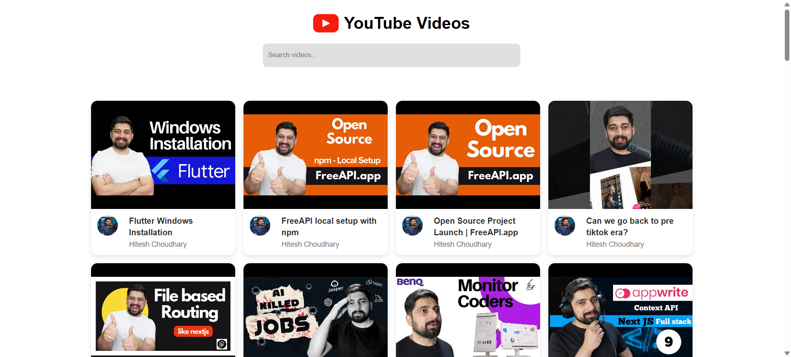

# YouTube-Style Video Listing Page

##  Overview
This project is a **YouTube-style video listing page** that fetches and displays videos from the FreeAPI YouTube endpoint. Users can view video thumbnails, titles, and channel names. A search bar allows users to filter videos **without additional API calls**, and clicking a video opens it in YouTube.

##  Features
-  Fetch and display a **list of YouTube videos**
-  Show **video thumbnails, titles, and channel names**
-  **Click on a video** to watch it on YouTube
-  **Search bar** for filtering videos on the frontend
-  **Responsive grid layout** for better UI

## API Used
 ### 1. Endpoint
```http
GET https://api.freeapi.app/api/v1/public/youtube/videos 
```


### 2. Documentation
``` 
https://freeapi.hashnode.space/api-guide/apireference/getYoutubeVideos
```

## Screenshots

<table>
  <tr>
    <td></td>
    <td></td>
  </tr>
  <tr>
    <td align="center"><b>Desktop View</b></td>
    <td align="center"><b>Mobile View</b></td>
  </tr>
</table>


## Tech Stack
- HTML5, CSS3, JavaScript (Frontend)
- Fetch API for retrieving video data
- CSS Grid & Flexbox for responsive design

## Installation & Setup
### 1. Clone the repository:
``` 
git clone https://github.com/rdmondal100/02-Youtube-Style-Video-Listing-page.git
```
### 2. Navigate to the project folder:
``` 
cd 02-Youtube-Style-Video-Listing-page
```
### 3. Open index.html in a browser

## Deployment
Live Demo: [Visit the live project](https://masterjiyoutubepage.netlify.app/)


## Connect with me
**Owner:** Riday Mondal  

[](https://instagram.com/ridaymondal100) [](https://linkedin.com/in/ridaymondal100) [](https://x.com/rdmondal100) [](mailto:rdmondal100@gmail.com)  

